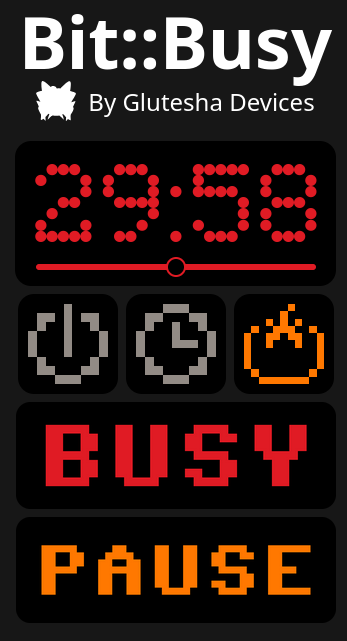
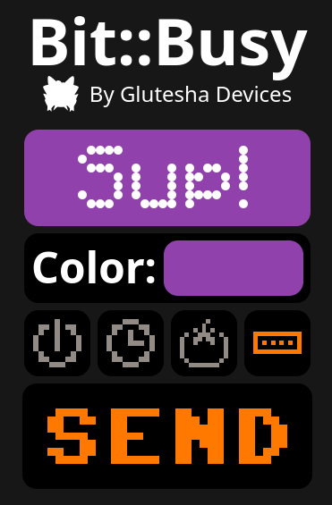
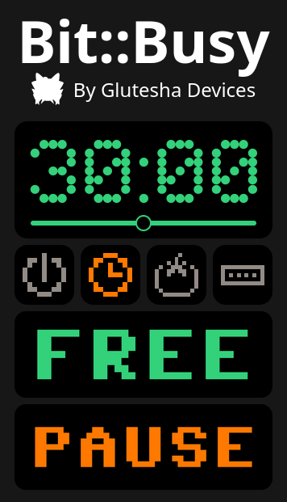
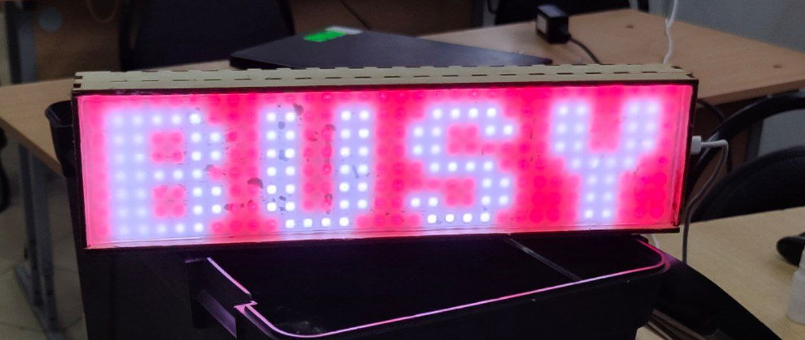

 

# Bitbusy   
Bitbusy is a LED bar based on ESP32 microcontroller and WS2812 LEDs that indicates your work status, so your collegues won't distract you. 20$ alternative to the Busy Bar that i've made for my mother's birthday
### Build and configure
Configure your device in ```src/defines.h```. Then, use ```./build-page.sh``` to build the wepbage. Then build and upload the filesystem image in PlatformIO. And only then upload the firmware.
To build the hardware, just connect your LED matrix to a desired port and set it in the defines. You can also use my blueprint from ```blueprint/box.dxf```. 
### Functionality
This device has 4 modes:
#### 1 - Binary
A basic on/off switch.
#### 2 - Timer
A timer that you can set and it will display BUSY before the timer hits 0.
#### 3 - Pomodoro Timer
A timer, that goes back on after your set time divided by 5.
#### 4 - Running string
A basic running string that you can set with a custom background color.

   
 


### Technologies
Project written in C++ using PlatformIO and Arduino framework. Images and animations made in https://lopaka.app . Uses ESPAsyncWebServer and ArduinoJSON for web stuff and Adafruit GFX for graphics. Webpage written in Svelte and Typescript.
